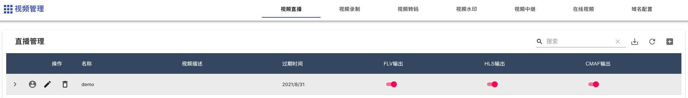
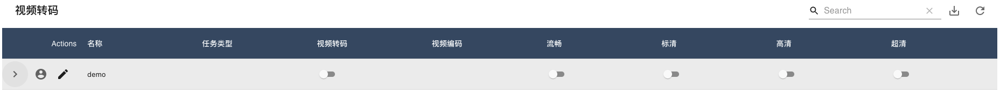
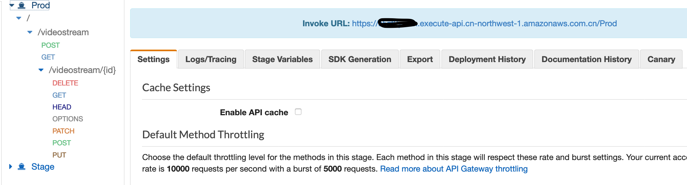
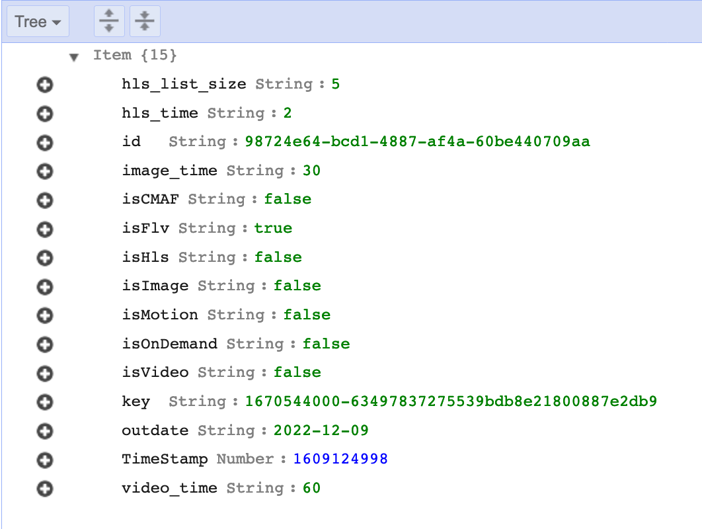
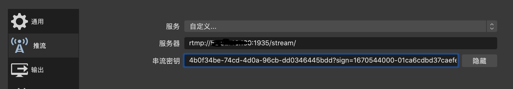

<!--
SPDX-FileCopyrightText: 2021 Amazon.com, Inc. or its affiliates. All Rights Reserved.

SPDX-License-Identifier: MIT-0 License
-->

# 基于无服务架构的直播和点播方案（[En](./README_en.md))

该方案基于AWS ECS，API Gateway，DynamoDB等托管服务，构建了包含视频推送，转码，水印，点播和分发等功能的一站式视频服务平台，具有服务可靠，资源弹性，部署简易等特点，通过AWS CloudFormation实现该方案的一键部署。


## 功能：
- **推流**：提供推流地址和海量设备的接入,支持主流 RTMP 协议推流。支持 OBS等常见的第三方推流软件，支持常见的第三方 RTMP 推流硬件和编码器或盒子等设备；
- **视频播放：** 支持HTTP-FLV（2秒延迟）和HLS\CMAF（大于10秒延迟）三种回放协议。 支持常见的第三方 FLV、RTMP、HLS 播放器VLC,FFPLAY；
- **视频处理功能**：视频转码、视频录制、视频截图，直播水印，直播中继等；；
- **视频频存储和点播 ：** 视频存储（可做冷/热分层），支持录制hls分片点播
- **直播控制台：** 提供API 管理和图形化管理（开发中） ；
- **地址管理：** 统一的推流域名、播流域名管理
- **安全：** 推流鉴权支持推流 URL 鉴权，播放鉴权利用CloudFront签名URL支持播放 URL 防盗链以及播放鉴权；

## 方案应用场景：
- 普通/低延迟直播：满足中、小型客户的普通和低延迟直播需求。如游戏、电商、媒体、教育等行业的直播
- 大并发上行视频云存储：将监控设备、智能设备通过标准化协议接入，在云端进行监控流的收录存储、媒体处理

## 方案特点：
- 无服务，端到端：基于云原生无服务架构，无需进行容量规划，减少运维负担，轻松扩展，按需付费。
- 简单、开放、集成：方案使用简单，不用复杂的配置，满足非专业客户直播推，转，拉的需求；具备很好的开放性，和aws的托管服务无缝集成
- 大容量、高负载：基于ECS弹性架构，根据推拉流的负载弹性伸缩，支持海量的视频流接入和拉取
- 自助化管理：可以通过控制台和API对直播流元数据进行管理，也可以根据需求设置适合您业务场景的直播功能，如录制、转码、截图，水印等
- 全球化部署：一键全球化部署，支持全球24个区域部署（包括北京和宁夏区域部署）


## 方案架构：


### 架构说明：
**视频接入服务：**
高可用代理服务器集群，通过ECS Service保证节点数量，提供RTMP推流地址和海量设备的接入，采用轻量级HAPoxy,支持rtmp，提供统一的推流地址：
```
rtmp://<DNS Name>/stream/<stream key>
```

**视频网关服务：**
基于Node media server实现高性能轻量级rtmp server，支持rtmp，rtmps推流接入，维护推流状态并将保存元数据信息，基于元数据模块的会话管理，基于事件回调维护推流客户端状态，检测客户端上下线，并根据状态调度ECS 任务
  
**元数据管理：**
使用dynamodb管理视频流元数据，通过API gateway提供元数据的CRUD管理的Restful API；动态设置视频流处理参数；自动生成唯一推流channel;通过API得到推流和拉流URL
  
**视频处理服务：**
基于Fargate实现视频转码，直播，录制，分片等功能，ECS Server自动管理流媒体服务器集群的数量和弹性伸缩，提供如下功能：
- 高性能，基于ngnix http server
- 视频流进行实时编码，转码
- 视频和图片分片和s3存储，自定义分片时间和转码参数，
- 支持HTTP-FLV（2秒延迟）和HLS\CMAF（10秒延迟）
- 动态调整参数，轻松与aws服务集成

**视频分发服务：**
- ECS Server自动管理视频流分发服务器集群的数量和弹性伸缩 ：Route53-> CloudFront-> ALB→ 视频流分发服务器→视频流处理服务器
- 通过自动寻址实现多路输入流-一路输出
- 内置NGINX缓存。尽可能减少服务器上的负载，避免惊群效应
- 利用cloudfront加速加下行拉流，签名URL

**管理控制台：**

管理控制台功能包括：
- 域名配置
- 直播管理
- 视频录制
- 水印配置
- 视频中继
- 在线视频

## 安装与部署：

**先决条件：**

点击[这里](https://cn-north-1.console.amazonaws.cn/cloudformation/home?region=cn-north-1#/stacks/create/template?stackName=AWSVideoStreamingPlatform&templateURL=https://live-video-and-vod-platform-template.s3.cn-north-1.amazonaws.com.cn/templates/live-video-and-vod-platform.main.template.yaml)直接跳转到对应的AWS CloudFormation控制台（北京），点击下一步进行部署


## 管理控制台使用说明：

**创建直播频道**

从CloudFormation控制台输出面板中，获取直播控制台地址，推流/拉流地址，拉流域名。


登陆进入直播控制台地址，点击“直播频道”右上角+创建直播频道，然后按照如下操作：
- 输入直播频道名称、描述和过期时间
- 选择视频输出格式,例如：HLS，FLV，CMAF
- 系统自动根据域名和过期时间生成签名推流地址


**获取推流地址和播放地址**

按照如下步骤操作：
- 点击箭头按钮，自动生成推流地址和播放地址
- 自动根据过期时间和私钥生成签名推流地址和推流二维码
- 自动生成HLS，FLV，CMAF拉流地址
- 点击对应输出的播放按钮，播放视频


**在线预览直播视频流**

按照如下步骤操作：
- 点击头像 按钮，显示直播视频浏览
- 自动生成视频流播放地址和二维码
- 根据不同的视频输出格式在线预览
- 直播推流成功后，大概需要35秒左右可在线看到直播流

**直播视频录制**

根据配置的录制规则对正在直播的视频进行录制和截图，按照如下步骤操作：
- 操作：点击修改按钮，修改直播视频录制的参数
- 录制格式：录制文件的格式，支持“JPG”“MP4”和”HLS”格式
- 存储位置:存储在自动生成的S3存储桶中（video-streaming-assets-assetsbucket开头）
- 参数：截图频率，MP4录制频率，HLS录制频率
- 任务类型：灵活选择转码任务类型，节省成本


**直播水印**

原始流视频画面添加上各种预设好的标志图片和文字，包括如下功能：
- 支持图片水印和文字水印
- 主要参数：包括水印位置和水印大小 ，文字及文字属性
- 图片水印参数：图片URL地址、图片高度，图片宽度，左右间距


**直播视频转码：**

将推送的直播流转码成多种分辨率和码率规格的视频流，包括如下功能：
- 适配不同播放终端；适配不同网络环境；降低分发成本
- 预置转码模板：支持选择视频画质，视频画质内置了常用的流畅、标清、高清和超清四种标准模板
- 任务类型：灵活选择转码任务类型，节省成本

|      | A                      | B          | C                    |
| ---- | ---------------------- | ---------- | -------------------- |
| 1    | 转码模板的分辨率和码率 |            |                      |
| 2    | **视频画质**           | **分辨率** | **码率（Kbps****）** |
| 3    | 流畅                   | 640*360    | 400                  |
| 4    | 标清                   | 854*480    | 600                  |
| 5    | 高清                   | 1280*720   | 1000                 |
| 6    | 超清                   | 1920*1080  | 2000                 |



**直播中继：**

在直播视频流中继转发，包括如下功能：
- 通过视频relay自动把原始视频流推送到其他视频直播平台
- 实现国内和海外同步直播


## API集成：

可以通过API Gateway提供的Restful API来对视频频道的元数据进行管理并集成到自己的应用和管理界面中

**创建视频流元数据**

获取API网关调用URL


通过 curl 发布视频流元数据

```
curl -d '{"isFlv":true, "isHls":false,"isVideo":false, "isImage":false,"isMotion":false, "isOnDemand":false,"isCMAF":false,"video_time":"60","image_time":"30","hls_time":"2","hls_list_size":"5", "outdate":"2022-12-09"}' -H "Content-Type: application/json" -X POST https://xxxxx.execute-api.cn-northwest-1.amazonaws.com.cn/Prod/videostream
```

从Dynamodb控制台获取您的流ID和签名密钥



**获取推流网址：**
从CloudFormation控制台获取推流地址之后，通过以下方式组装视频推送的RTMP地址：

```
rtmp://<LiveVideoPushStreamURL>/stream/98724e64-bcd1-4887-af4a-60be440709aa?sign=1670544000-63497837275539bdb8e21800887e2db9
```

配置对应的推流软件如OBS来进行视频推送


其他配置如下所示：
- 编码器： x264
- 速率控制：CBR
- 比特率： 1000 (或更低)
- 关键帧间隔（秒，0=自动）：2
- CPU Usage Preset (higher = less CPU) ：veryfast, 
- Tune： zerolatency

通过视频播放器（ffplayer）或浏览器查看视频

```
ffplay http://<LiveVideoPullStreamURL>/98724e64-bcd1-4887-af4a-60be440709aa/live.flv

http://<LiveVideoPullStreamURL>/98724e64-bcd1-4887-af4a-60be440709aa/flv.html
```

## Security

See [CONTRIBUTING](CONTRIBUTING.md#security-issue-notifications) for more information.

## License

This library is licensed under the MIT-0 License. See the LICENSE file.