<!--
SPDX-FileCopyrightText: 2021 Amazon.com, Inc. or its affiliates. All Rights Reserved.

SPDX-License-Identifier: MIT-0 License
-->

<!--
SPDX-FileCopyrightText: 2021 Amazon.com， Inc. or its affiliates. All Rights Reserved.

SPDX-License-Identifier: MIT-0 License
-->

# Serverless Video Streaming Platform（[Zh](./README.md)）

The solution is based on Amazon ECS, API Gateway, DynamoDB and other managed services, to build a one-stop video service platform including video push, transcoding, watermarking, on-demand play and distribution functions, with characteristics of high availability, resource auto-scaling, and easy-to-use. All services involved in solution are deployed through Amazon CloudFormation, with deterministic deployment with Infrastructure As Code. Whole data flows are as shown below:

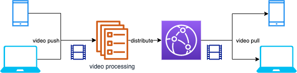

## Solution Features：
- Streaming: Provides streaming addresses and access to a large number of devices, supports mainstream RTMP protocol; supports common third-party streaming software such as OBS, supports common third-party RTMP streaming hardware (encoders or boxes);
- Video playback: support HTTP-FLV (2 seconds delay) and HLS/CMAF (more than 10 seconds delay) three playback protocols; support common third-party FLV, RTMP, HLS players VLC, FFPLAY;
- Video processing functions: video transcoding, video recording, video screenshots, live watermarking, live relaying, etc.;
- Video frequency storage and on-demand: video storage (cold/hot layering is available), support recording hls fragments on-demand;
- Management console: Provide API management and graphical management;
- Address management: unified streaming domain name and streaming domain name management;
- Security: supports push stream URL authentication, using CloudFront signed URL for playback authentication, supports playback URL anti-theft chaining and playback authentication;

## Solution Applicable Senario：
- Ordinary/low-latency live streaming: to meet the ordinary and low-latency live streaming needs of small and medium-sized customers, such as live streaming in games, e-commerce, media, education and other industries;
- Large-concurrent uplink video cloud storage: to connect monitoring equipment and smart devices through standardized protocols, and perform recording, storage and video processing for video streaming in cloud;

## Solution Characteristic：
- Serverlsss, end-to-end: Based on Amazon cloud-native architecture, no capacity planning is required, and operation and maintenance effort is reduce to great extent;
- Simple, open source, easy integrated: to meet the needs of non-professional customers for live video streaming, transfer, and pull to play, all service are open sourced and seamless integrated with Amazon hosting services;
- Large capacity supporting multiple channels: Based on ECS elastic architecture, resource can be auto-scaled according to workloads of push-pull streams, thus supporting massive video stream channel in parallel;
- Console management: You can manage video stream metadata through graphical console and API, and you can also set up live streaming functions suitable for your business scenarios according to your needs, such as recording, transcoding, screenshots, watermarks, etc.
- One-click deployment: One-click deployment of the solution through CloudFormation (Beijing, Ningxia region)

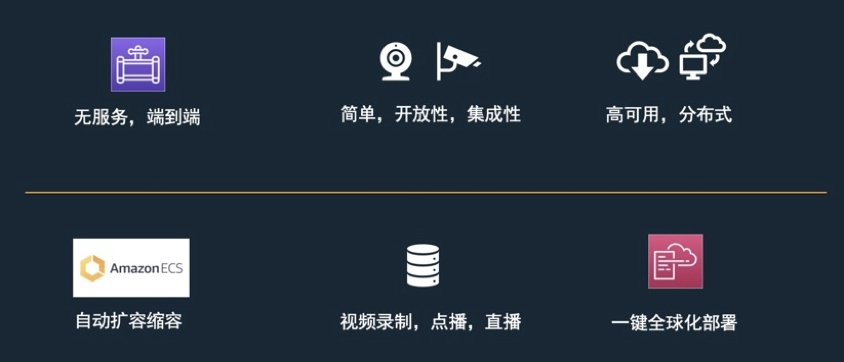

## Overall Architecture：

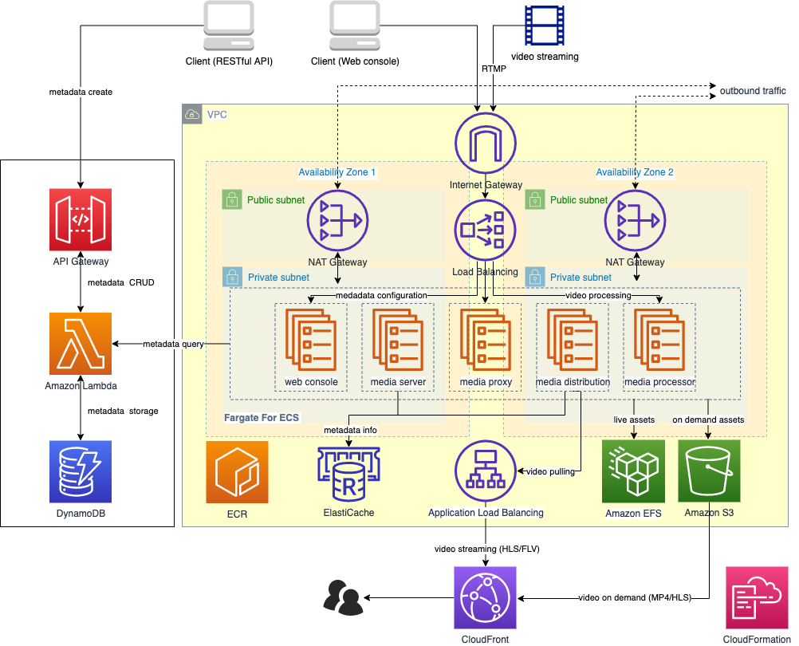

### Key Modules

**Video Proxy**

High-availability proxy server cluster built on ECS Service, providing RTMP streaming addresses and massive devices accessing, adopts lightweight HAPoxy, supports RTMP and provides unified streaming addresses:

```
RTMP://<DNS Name>/stream/<stream key>
```

**Video Gateway**
High-performance and lightweight RTMP server based on Node media server, support RTMP/RTMPs stream access, maintain metadata including streaming status, channel session etc., maintain push stream client status based on event callbacks, to monitor client's online status, and schedule ECS tasks accordingly
  
**Meta Data Management**
Use DynamoDB to manage metadata of video stream, and provide Restful API of CRUD management of metadata through the API gateway; Dynamically configure video stream processing parameters; Auto generate a unique video push channel; Fetch video push & pull URLs through the API
  
**Video Processing**
Video live streaming, transcoding, recording, fragmentation and other functions based on Fargate, including:

- High performance ngnix http server
- Video real time encoding & transcoding
- Video & image fragmentation and S3 storagem, customized fragmentation time and transcoding parameters
- Suppoer HTTP-FLV (2s delay) and HLS/CMAF (10s delay)
- Adjust parameter dynamically, seamless integrate with Amazon services

**Video Distribution**
Channel addressing and video acceleration based on Fargate and CloudFront, including:

- Video distribution cluster management, video stream pulling path：Route53-> CloudFront-> ALB-> video distribution service-> video processing service
- Realize multiple input streams to one output through automatic addressing
- Built-in Nginx cache to reduce the load on the server as much as possible to avoid thundering herd problem
- Using CloudFront to optimize the downstream experience and secure video access through signed URL

**Demo Web page**
**Note that this web page is for demonstration purposes only, solution WILL NOT create such web page by default unless explicit configured in CloudFormation parameter**

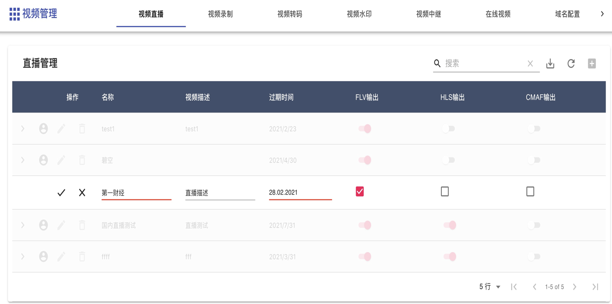

Function of demo web page include:

- Domain configuration
- Live streaming managment
- Video recording
- Watermark configuration
- Video Relay
- VoD

## Installation & Deployment：

**Prerequisite**

- Make sure you have a domain name registered by ICP，click[**here**](https://www.amazonaws.cn/support/icp/?nc1=h_ls) to understand how to file for ICP

Click [**Here**](https://cn-north-1.console.amazonaws.cn/cloudformation/home?region=cn-north-1#/stacks/create/template?stackName=AWSVideoStreamingPlatform&templateURL=https://aws-gcr-solutions.s3.cn-north-1.amazonaws.com.cn/serverless-video-streaming/v1.0.0/aws-serverless-video-streaming.main.template.yaml) to jump Amazon CloudFormation console (Beijing), click Next to deploy


Click Next to configure the deployment options. InstallDemoConsole configures whether to deploy the user demo web interface, default value is false. CNAME configures the CNAMEs associated with CloudFront. ZHY/BJS region users need to use the registered domain name for association. Overseas users do not have such requirement, default value is www.example.cn

[**optional**]After the solution is deployed, if you want to distribute video streams via HTTPS to further enhance security, you can follow the steps below to additionally configure your CloudFront and Elastic Load Balancer services

- Step1, obtain the SSL certificate corresponding to your domain name
install certbot，execute command below (for mac user)
```
brew install certbot
sudo certbot certonly --manual --preferred-challenges dns -d "*.<your domain prefix>.aws.a2z.org.cn"
```
After execution, the console prompts similar information as follows:
```
Please deploy a DNS TXT record under the name
_acme-challenge.<your domain prefix>.aws.a2z.org.cn with the following value:

8ZCAA6XvwLKK3MiGLRufX1p0_gIHnT-****
```
following instruction “_acme-challenge.<your domain prefix>.aws.a2z.org.cn Route 53 TXT type entry and set the value to 8ZCAA6XvwLKK3MiGLRufX1p0_gIHnT-****” to add the corresponding string to the domain name record you manage, and then click confirm. You will get the signed certificate. The mac user certificate is stored in the /etc/letsencrypt/live/ directory

- Step2, upload SSL certificate to IAM
```
sudo aws iam upload-server-certificate \
--path '/cloudfront/' \
--server-certificate-name '+.<your domain prefix>.aws.a2z.org.cn' \
--certificate-body file:///etc/letsencrypt/live/<your domain prefix>.aws.a2z.org.cn/cert.pem \
--private-key file:///etc/letsencrypt/live/<your domain prefix>.aws.a2z.org.cn/privkey.pem \
--certificate-chain file:///etc/letsencrypt/live/<your domain prefix>.aws.a2z.org.cn/chain.pem \
--profile xx --region cn-northwest-1
```

- Step3, open CloudFront console, find your distribution，then click General -> Edit -> Custom SSL Certificate (example.com) in "SSL Certificate” -> choose the SSL certificate you upload in previous step
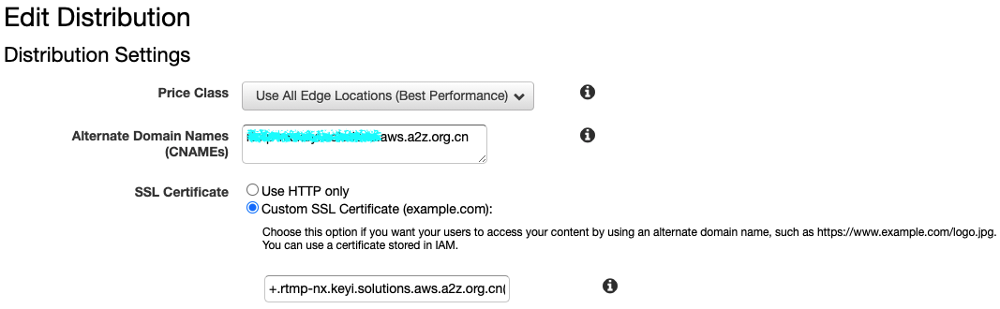

- Step4, open EC2 console and click Load Balancer，find Load Balancer with prefix origin，then click Add listener -> Default SSL certificate -> choose the SSL certificate you upload in previous step
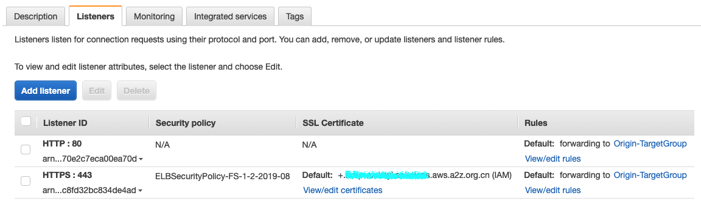
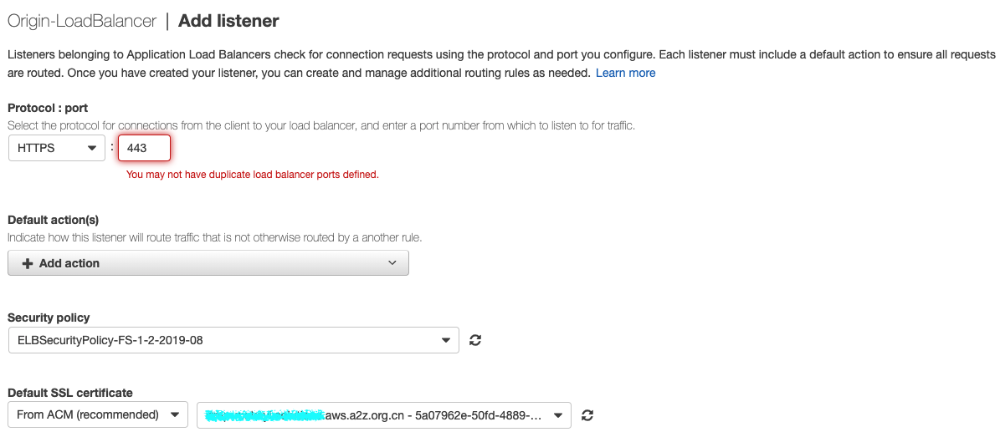

## Create Live Streaming Channel
The solution uses the RESTFul API provided by API Gateway to manage video channel metadata and integrate it into existing application and management interface. After the solution is deployed, navigate to the nest stack prefixed with VideoMetadata, and check the output option to obtain the URL address created by API Gateway.


POST the URL address through tools such as Curl or Postman to create a live channel, where the main content of the request is as follows

```
{"isFlv":true, "isHls":true, "isVideo":false, "isImage":true, "isMotion":false, "isOnDemand":false, "isCMAF":false, "video_time":"60", "image_time":"30", "hls_time":"2", "hls_list_size":"5", "outdate":"2022-12-09"}
```

create live channel by Curl

```
curl -d '{"isFlv":true, "isHls":false, "isVideo":true, "isImage":false, "isMotion":false, "isOnDemand":false, "isCMAF":false, "video_time":"60", "image_time":"30", "hls_time":"2", "hls_list_size":"5", "outdate":"2022-12-09"}' -H "Content-Type: application/json" -X POST https://xxxxx.execute-api.cn-northwest-1.amazonaws.com.cn/Prod/videostream
```

Create a live channel through Thunder Client. After the creation is successful, you will get the corresponding return information


Navigate to DynamoDB console and check table named video-metadata. You can see corresponding channel information has been created. Record the two strings of channel id and key as shown in the figure.

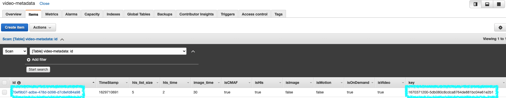

The above string is spliced ​​in the following format and used as the streaming key for subsequent video push

**Streaming Key Format**

```
<id>?sign=<key>
```

**Example as follows**
```
70ef9b07-adbe-478d-b098-d7c8efd84a98?sign=1670371200-5db080c8cdca8764de881bc04e61e2b1
```

**Streaming URL**
After obtaining the streaming URL from the CloudFormation console, splice the RTMP address of the video streaming in the following way:

```
rtmp://<LiveVideoPushStreamURL>/stream/98724e64-bcd1-4887-af4a-60be440709aa?sign=1670544000-63497837275539bdb8e21800887e2db9
```

Configure corresponding streaming software e.g. OBS to push video stream


Other configurations are shown below:

- Encoder: x264
- Rate Control: CBR
- Bit Rate：1000 (or lower)
- Key Frame Gap（Second，0=Auto）：2
- CPU Usage Preset (higher = less CPU) ：veryfast， 
- Tune：zerolatency

View video through video player (ffplayer) or browser

```
ffplay http://<LiveVideoPullStreamURL>/98724e64-bcd1-4887-af4a-60be440709aa/live.flv

http://<LiveVideoPullStreamURL>/98724e64-bcd1-4887-af4a-60be440709aa/flv.html
```

## Console Usage：

**Note that this web page is for demonstration purposes only, solution WILL NOT create such web page by default unless explicit configured in CloudFormation parameter**

Get the management console address, push/pull stream address, and pull stream domain name from the CloudFormation console output panel, 

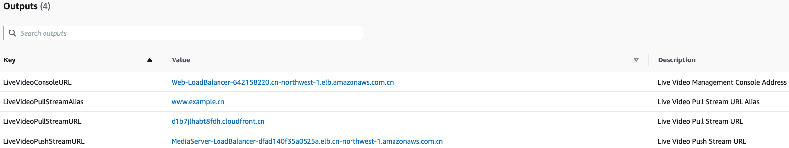

Log in to console address, click on the upper right corner of "Live Channel" + to create a channel, and then do the following:

- Enter channel name, description and expiration time
- Select the video output format, for example: HLS, FLV, CMAF
- Platform will automatically generates a signatured push address based on the domain name and expiration time

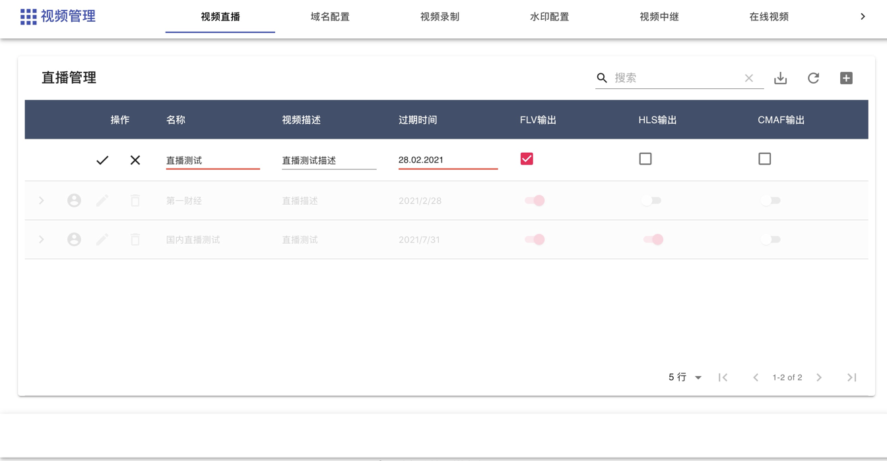

**Get video push address and playback address**

Follow steps below：

- Click the arrow button to automatically generate the push stream address and playback address
- Automatically generate signature push address and push QR code based on expiration time and private key
- Automatically generate HLS, FLV, CMAF streaming addresses

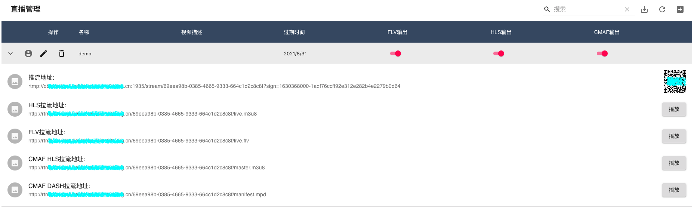

**Preview live streaming**

Follow steps below：

- Click the avatar button to display details
- Auto generated video stream playback address and QR code are displayed
- Preview will displayed according to different video output formats
- It takes about 35 seconds to see the live streaming online after initial push

**Video Recording**

To record and screenshot live video streaming according configured parameters, follow steps below:

- Click switch button turn on corresponding function
- Support JPG, MP4 and HLS output format
- Assetes store in auto created S3 bucket
- Set suitable snapshot & record frequency for optimized cost

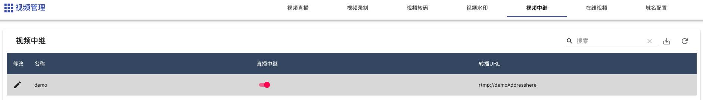

**Video Watchmark**

Add pictures, icons or texts to original streaming video screen, including the following functions:

- Support picture pictures, icons and texts
- Configurable parameter including watermark position, size, text and text attributes
- Picture watermark parameters: picture URL address, picture height, width, left and right spacing

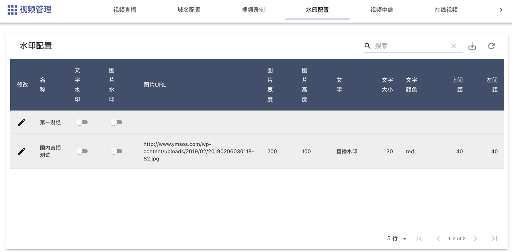

**Video Transcoding**

Transcode pushed live stream into a video stream with multiple resolutions and bitrate specifications, functions include:

- Adapt to different playback terminals; adapt to different network environments; reduce distribution costs
- Pre-built transcoding template: 4 commonly used templates for smooth, SD, HD and ultra-definition

The resolution and bit rate of the transcoding template are as follows:

|      | **Quality**            | **Resolution**  | **Bitrate（Kbps）**      |
| ---- | --------------------- | ---------- | -------------------- |
|      | Smooth                   | 640*360    | 400                  |
|      | SD                   | 854*480    | 600                  |
|      | HD                   | 1280*720   | 1000                 |
|      | UHD                   | 1920*1080  | 2000                 |

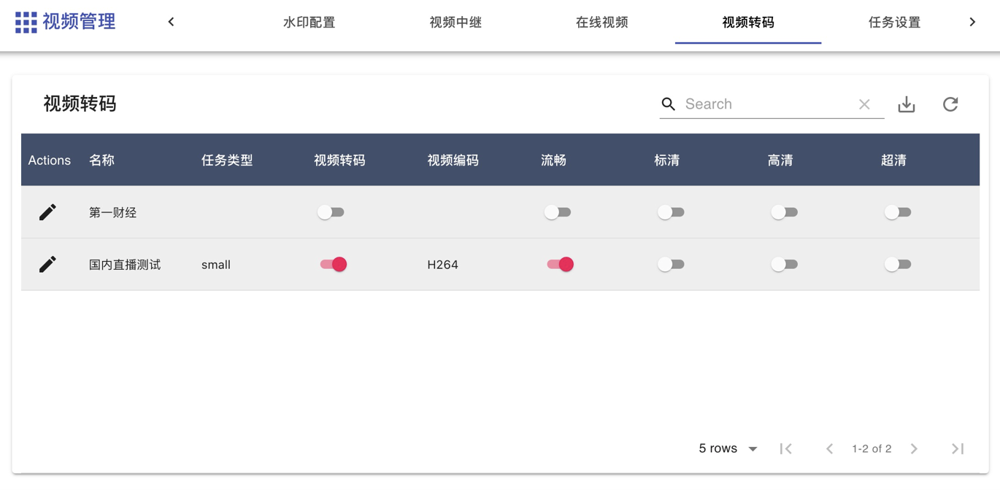

**Video Relay**

Relay and forward video streams, including following functions:

- Automatically push the original video stream to other live video platforms through such video relay
- Synchronous live streaming with native & overseas 

## Security

See [CONTRIBUTING](CONTRIBUTING.md#security-issue-notifications) for more information.

## License

This library is licensed under the MIT-0 License. See the LICENSE file.