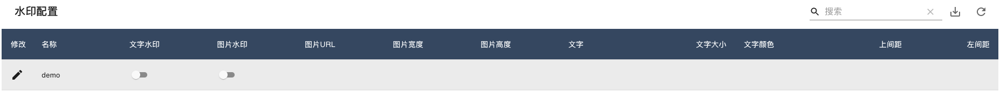
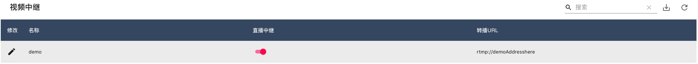
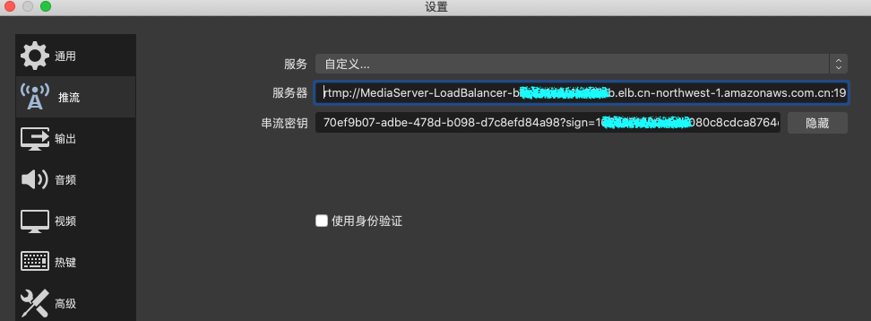

<!--
SPDX-FileCopyrightText: 2021 Amazon.com, Inc. or its affiliates. All Rights Reserved.

SPDX-License-Identifier: MIT-0 License
-->

<!--
SPDX-FileCopyrightText: 2021 Amazon.com， Inc. or its affiliates. All Rights Reserved.

SPDX-License-Identifier: MIT-0 License
-->

# AWS Serverless Video Streaming Platform（[Zh](./README.md)）

The solution is based on AWS ECS, API Gateway, DynamoDB and other managed services, to build a one-stop video service platform including video push, transcoding, watermarking, on-demand play and distribution functions, with characteristics of high availability, resource auto-scaling, and easy-to-use. All services involved in solution are deployed through AWS CloudFormation, with deterministic deployment with Infrastructure As Code. Whole data flows are as shown below:


## Solution Features：
- Streaming: Provides streaming addresses and access to a large number of devices, supports mainstream RTMP protocol; supports common third-party streaming software such as OBS, supports common third-party RTMP streaming hardware (encoders or boxes);
- Video playback: support HTTP-FLV (2 seconds delay) and HLS/CMAF (more than 10 seconds delay) three playback protocols; support common third-party FLV, RTMP, HLS players VLC, FFPLAY;
- Video processing functions: video transcoding, video recording, video screenshots, live watermarking, live relaying, etc.;
- Video frequency storage and on-demand: video storage (cold/hot layering is available), support recording hls fragments on-demand;
- Management console: Provide API management and graphical management;
- Address management: unified streaming domain name and streaming domain name management;
- Security: supports push stream URL authentication, using CloudFront signed URL for playback authentication, supports playback URL anti-theft chaining and playback authentication;

## Solution Applicable Senario：
- Ordinary/low-latency live streaming: to meet the ordinary and low-latency live streaming needs of small and medium-sized customers, such as live streaming in games, e-commerce, media, education and other industries;
- Large-concurrent uplink video cloud storage: to connect monitoring equipment and smart devices through standardized protocols, and perform recording, storage and video processing for video streaming in cloud;

## Solution Characteristic：
- Serverlsss, end-to-end: Based on AWS cloud-native architecture, no capacity planning is required, and operation and maintenance effort is reduce to great extent;
- Simple, open source, easy integrated: to meet the needs of non-professional customers for live video streaming, transfer, and pull to play, all service are open sourced and seamless integrated with AWS hosting services;
- Large capacity supporting multiple channels: Based on ECS elastic architecture, resource can be auto-scaled according to workloads of push-pull streams, thus supporting massive video stream channel in parallel;
- Console management: You can manage video stream metadata through graphical console and API, and you can also set up live streaming functions suitable for your business scenarios according to your needs, such as recording, transcoding, screenshots, watermarks, etc.
- One-click deployment: One-click deployment of the solution through CloudFormation (Beijing, Ningxia region)


## Overall Architecture：


### Key Modules

**Video Proxy**

High-availability proxy server cluster built on ECS Service, providing RTMP streaming addresses and massive devices accessing, adopts lightweight HAPoxy, supports RTMP and provides unified streaming addresses:

```
RTMP://<DNS Name>/stream/<stream key>
```

**Video Gateway**
High-performance and lightweight RTMP server based on Node media server, support RTMP, RTMPs stream access, maintain metadata including streaming status, channel session etc., maintain push stream client status based on event callbacks, to monitor client's online staus, and schedule ECS tasks accordingly.
  
**Meta Data Management**
Use dynamodb to manage metadata of video stream, and provide Restful API of CRUD management of metadata through the API gateway; Dynamically configure video stream processing parameters; Auto generate a unique video push channel; Fetch video push & pull URLs through the API
  
**Video Processing**
Video live streaming, transcoding, recording, fragmentation and other functions, using ECS cluster to manage resource scheduling and auto scaling, providing functions including:
- High performance ngnix http server
- Video real time encoding & transcoding
- Video & image fragmentation and S3 storagem, customized fragmentation time and transcoding parameters
- Suppoer HTTP-FLV (2s delay) and HLS/CMAF (10s delay)
- Adjust parameter dynamically, seamless integrate with AWS services

**Video Distribution**
- Video distribution cluster management, video stream pulling path：Route53-> CloudFront-> ALB-> video distribution service-> video processing service
- Realize multiple input streams to one output through automatic addressing
- Built-in Nginx cache to reduce the load on the server as much as possible to avoid thundering herd problem
- Using CloudFront to optimize the downstream experience and secure video access through signed URL

**Management Console**

Function of console include:
- Domain configuration
- Live streaming managment
- Video recording
- Watermark configuration
- Video Relay
- VoD

## Installation & Deployment：

**Prerequisite**

Click [Here](https://cn-north-1.console.amazonaws.cn/cloudformation/home?region=cn-north-1#/stacks/create/template?stackName=AWSVideoStreamingPlatform&templateURL=https://aws-gcr-solutions.s3.cn-north-1.amazonaws.com.cn/serverless-video-streaming/v1.0.0/aws-serverless-video-streaming.main.template.yaml) to jump AWS CloudFormation console (Beijing), click Next to deploy


## Console Usage：

**Create Channel**

Get the management console address, push/pull stream address, and pull stream domain name from the CloudFormation console output panel, 


Log in to console address, click on the upper right corner of "Live Channel" + to create a channel, and then do the following:
- Enter channel name, description and expiration time
- Select the video output format, for example: HLS, FLV, CMAF
- Platform will automatically generates a signatured push address based on the domain name and expiration time


**Get video push address and playback address**

Follow steps below：
- Click the arrow button to automatically generate the push stream address and playback address
- Automatically generate signature push address and push QR code based on expiration time and private key
- Automatically generate HLS, FLV, CMAF streaming addresses


**Preview live streaming**

Follow steps below：
- Click the avatar button to display details
- Auto generated video stream playback address and QR code are displayed
- Preview will displayed according to different video output formats
- It takes about 35 seconds to see the live streaming online after initial push

**Video Recording**

To record and screenshot live video streaming according configured parameters, follow steps below:
- Click switch button turn on corresponding function
- Support JPG, MP4 and HLS output format
- Assetes store in auto created S3 bucket
- Set suitable snapshot & record frequency for optimized cost


**Video Watchmark**

Add pictures, icons or texts to original streaming video screen, including the following functions:
- Support picture pictures, icons and texts
- Configurable parameter including watermark position, size, text and text attributes
- Picture watermark parameters: picture URL address, picture height, width, left and right spacing



**Video Transcoding**

Transcode pushed live stream into a video stream with multiple resolutions and bitrate specifications, functions include:
- Adapt to different playback terminals; adapt to different network environments; reduce distribution costs
- Pre-built transcoding template: 4 commonly used templates for smooth, SD, HD and ultra-definition

转码模板的分辨率和码率如下所示：

|      | **视频画质**            | **分辨率**  | **码率（Kbps）**      |
| ---- | --------------------- | ---------- | -------------------- |
|      | 流畅                   | 640*360    | 400                  |
|      | 标清                   | 854*480    | 600                  |
|      | 高清                   | 1280*720   | 1000                 |
|      | 超清                   | 1920*1080  | 2000                 |


**Video Relay**

Relay and forward video streams, including following functions:
- Automatically push the original video stream to other live video platforms through such video relay
- Synchronous live streaming with native & overseas 



## API integration:

You can manage metadata of the video channel through Restful API provided by API Gateway, and integrate it into your own application and management interface

**Create Video Metadata**

Aquire invoking URL through API Gateway console


Publish video stream metadata via curl

```
curl -d '{"isFlv":true， "isHls":false，"isVideo":false， "isImage":false，"isMotion":false， "isOnDemand":false，"isCMAF":false，"video_time":"60"，"image_time":"30"，"hls_time":"2"，"hls_list_size":"5"， "outdate":"2022-12-09"}' -H "Content-Type: application/json" -X POST https://xxxxx.execute-api.cn-northwest-1.amazonaws.com.cn/Prod/videostream
```

Get stream ID and signing key from the DynamoDB console


**Acquire Stream Push URL**
Use following methods to assemble the RTMP address to push video stream, after obtaining the video streaming URL from CloudFormation console, 

```
RTMP://<LiveVideoPushStreamURL>/stream/98724e64-bcd1-4887-af4a-60be440709aa?sign=1670544000-63497837275539bdb8e21800887e2db9
```

Configure corresponding streaming software e.g. OBS to push video stream


Other configurations are shown below:
- Encoder: x264
- Rate Control: CBR
- Bit Rate：1000 (or lower)
- Key Frame Gap（Second，0=Auto）：2
- CPU Usage Preset (higher = less CPU) ：veryfast， 
- Tune：zerolatency

View video through video player (ffplayer) or browser

```
ffplay http://<LiveVideoPullStreamURL>/98724e64-bcd1-4887-af4a-60be440709aa/live.flv

http://<LiveVideoPullStreamURL>/98724e64-bcd1-4887-af4a-60be440709aa/flv.html
```

## Security

See [CONTRIBUTING](CONTRIBUTING.md#security-issue-notifications) for more information.

## License

This library is licensed under the MIT-0 License. See the LICENSE file.