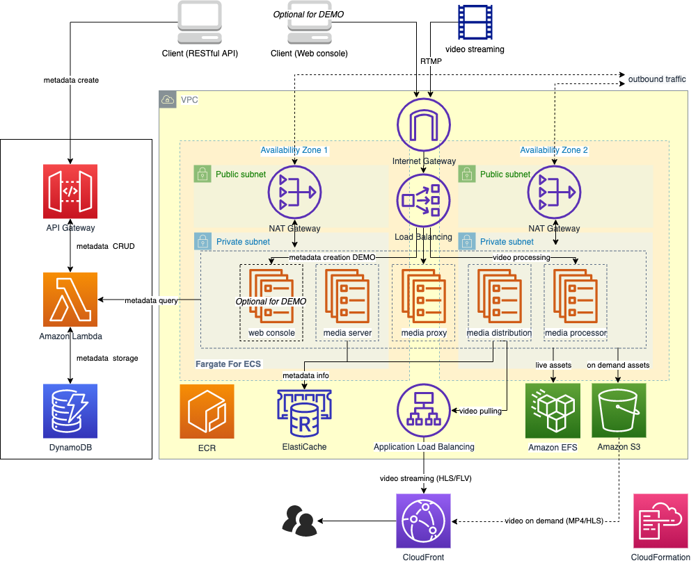
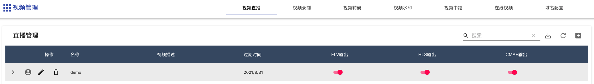
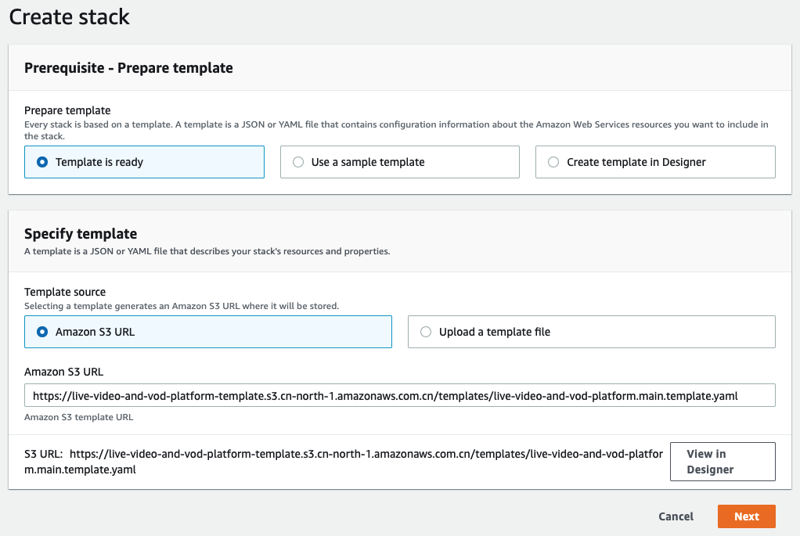
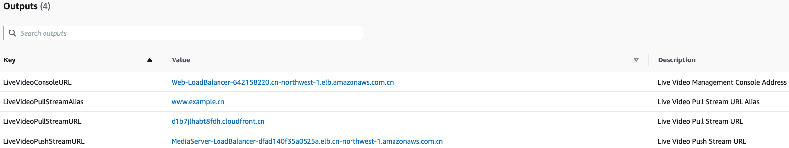
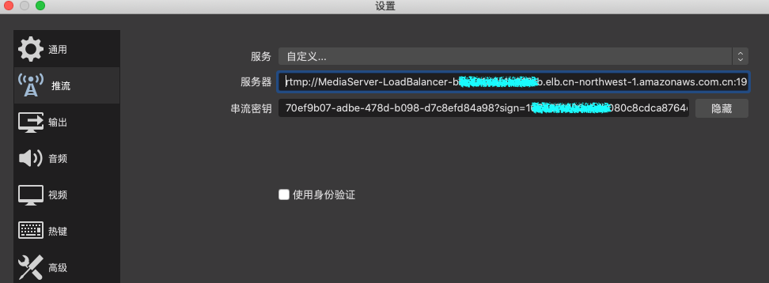
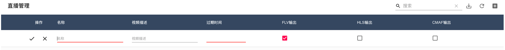
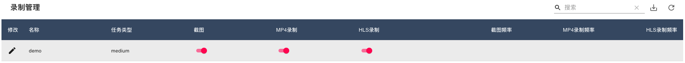
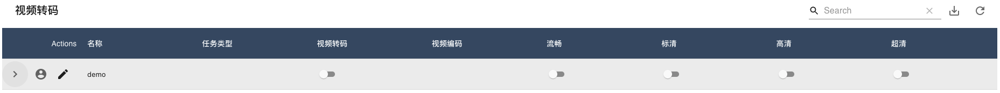
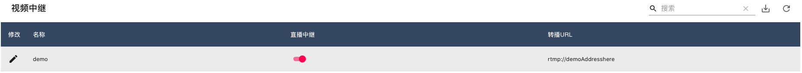

<!--
SPDX-FileCopyrightText: 2021 Amazon.com， Inc. or its affiliates. All Rights Reserved.

SPDX-License-Identifier: MIT-0 License
-->

# 基于无服务架构的直播和点播方案（[En](../en/index.html)）

该方案基于Amazon ECS，API Gateway，DynamoDB等托管服务，构建了包含视频推送，转码，水印，点播和分发等功能的一站式视频服务平台，具有服务可靠，资源弹性，部署简易等特点，方案涉及的所有服务通过Amazon CloudFormation实现一键部署，其中数据流向如下：


## 功能：

* 推流：提供推流地址和海量设备的接入，支持主流RTMP协议推流；支持OBS等常见的第三方推流软件，支持常见的第三方RTMP推流硬件（编码器或盒子）；
* 视频播放：支持HTTP-FLV（2秒延迟）和HLS/CMAF（大于10秒延迟）三种回放协议；支持常见的第三方FLV，RTMP，HLS播放器VLC，FFPLAY；
* 视频处理功能：视频转码，视频录制，视频截图，直播水印，直播中继等；
* 视频频存储和点播：视频存储（可做冷/热分层），支持录制hls分片点播；
* 直播控制台：提供API管理和图形化管理；
* 地址管理：统一的推流域名，播流域名管理；
* 安全：推流鉴权支持推流URL鉴权，播放鉴权利用CloudFront签名URL支持播放URL防盗链以及播放鉴权；

## 方案应用场景：

* 普通/低延迟直播：满足中，小型客户的普通和低延迟直播需求，如游戏，电商，媒体，教育等行业的直播；
* 大并发上行视频云存储：将监控设备，智能设备通过标准化协议接入，在云端进行监控流的收录存储，媒体处理；

## 方案特点：

* 无服务，端到端：基于云原生无服务架构，无需进行容量规划，减少运维负担，轻松扩展，按需付费；
* 简单，开放，集成：方案使用简单，不用复杂的配置，满足非专业客户直播推，转，拉的需求；具备很好的开放性，同Amazon托管服务无缝集成；
* 大容量，高负载：基于ECS弹性架构，根据推拉流的负载弹性伸缩，支持海量的视频流接入和拉取；
* 自助化管理：可以通过控制台和API对直播流元数据进行管理，也可以根据需求设置适合您业务场景的直播功能，如录制，转码，截图，水印等
* 一键部署：通过CloudFormation实现方案的一键部署（北京，宁夏区域）


## 方案架构：



### 架构说明：
**视频接入服务：**
高可用代理服务器集群，通过ECS Service保证节点数量，提供RTMP推流地址和海量设备的接入，采用轻量级HAPoxy，提供统一的推流地址：

```
rtmp://<DNS Name>/stream/<stream key>
```

**视频网关服务：**
基于Node media server实现高性能轻量级RTMP server，支持RTMP/RTMPS推流接入，维护推流状态并将保存元数据信息，基于元数据模块的会话管理，基于事件回调维护推流客户端状态，检测客户端上下线，并根据状态调度ECS任务
  
**元数据管理：**
使用dynamodb管理视频流元数据，通过API gateway提供元数据的CRUD管理的Restful API；动态设置视频流处理参数；自动生成唯一推流channel;通过API得到推流和拉流URL
  
**视频处理服务**
基于Fargate实现视频转码，直播，录制，分片等功能，包括：

* 高性能，基于Ngnix HTTP server
* 视频流进行实时编码，转码
* 视频和图片分片和S3存储，自定义分片时间和转码参数，
* 支持HTTP-FLV（2秒延迟）和HLS\CMAF（10秒延迟）
* 动态调整参数，轻松与Amazon服务集成

**视频分发服务**
基于Fargate和CloudFront实现频道寻址，视频加速，包括：

* 视频流分发底层服务的弹性伸缩
* 通过自动寻址实现多路输入流到一路输出
* 内置Nginx缓存，尽可能减少服务器上的负载，避免惊群效应
* 利用CloudFront优化下行拉流体验，通过signed URL实现视频的安全访问

**演示web：注意该web界面仅作演示用途，默认方案不会创建该web界面，需要在CloudFormation中的参数显式指定**



演示web功能包括：

* 域名配置
* 直播管理
* 视频录制
* 水印配置
* 视频中继
* 在线视频

## 安装与部署：

**先决条件：**

* 确保您有ICP备案的域名，点击[**这里**](https://www.amazonaws.cn/support/icp/?nc1=h_ls)了解如何进行ICP备案。

点击[**这里**](https://cn-north-1.console.amazonaws.cn/cloudformation/home?region=cn-north-1#/stacks/create/template?stackName=AWSVideoStreamingPlatform&templateURL=https://aws-gcr-solutions.s3.cn-north-1.amazonaws.com.cn/serverless-video-streaming/v1.0.0/aws-serverless-video-streaming.main.template.yaml)跳转到对应的Amazon CloudFormation控制台（北京），点击下一步进行部署



点击下一步进行部署选项配置，其中InstallDemoConsole配置是否部署用户演示的web界面，默认为false，CNAME配置CloudFront所关联的CNAMEs，大陆用户需要使用备案域名进行关联，否则会导致您的域名无法访问，海外用户无此要求，默认为www.example.cn。网络配置部分，您需要最少选择两个可用区以进行VPC网络的创建。最后需要注意栈名称的最大长度为128个字符，我们建议您使用较短的名称进行命名，比如：LiveStream。

[**可选**]在方案部署完毕之后，如果您希望通过HTTPS方式分发视频流以进一步增强安全性，则可以按照下列步骤来额外配置您的CloudFront和Elastic Load Balancer服务

* 步骤一，获取您域名对应的SSL证书
安装certbot，执行如下命令（mac用户）
```
brew install certbot
sudo certbot certonly --manual --preferred-challenges dns -d "*.<your domain prefix>.aws.a2z.org.cn"
```
执行后界面提示类似信息如下：
```
Please deploy a DNS TXT record under the name
_acme-challenge.<your domain prefix>.aws.a2z.org.cn with the following value:

8ZCAA6XvwLKK3MiGLRufX1p0_gIHnT-****
```
按照提示“_acme-challenge.<your domain prefix>.aws.a2z.org.cn Route 53 TXT type entry and set the value to 8ZCAA6XvwLKK3MiGLRufX1p0_gIHnT-****”将对应字符串添加到您管理的域名记录中，然后点击确认您将获取到签名证书，mac用户证书存放在/etc/letsencrypt/live/目录下

* 步骤二，上传SSL证书到IAM
```
sudo aws iam upload-server-certificate \
--path '/cloudfront/' \
--server-certificate-name '+.rtmp-nx.keyi.solutions.aws.a2z.org.cn' \
--certificate-body file:///etc/letsencrypt/live/<your domain prefix>.aws.a2z.org.cn/cert.pem \
--private-key file:///etc/letsencrypt/live/<your domain prefix>.aws.a2z.org.cn/privkey.pem \
--certificate-chain file:///etc/letsencrypt/live/<your domain prefix>.aws.a2z.org.cn/chain.pem \
--profile xx --region cn-northwest-1
```

* 步骤三，打开CloudFront控制台，找到您的distribution，然后点击General -> Edit -> Custom SSL Certificate (example.com) in "SSL Certificate” -> 选择您在之前上传的SSL证书


* 步骤四，打开EC2控制台找到Load Balancer，找到您的前缀为origin的Load Balancer，然后点击Add listener -> Default SSL certificate -> 选择您在之前上传的SSL证书


## 创建直播频道
方案通过API Gateway提供的Restful API来对视频频道的元数据进行管理并集成到自己的应用和管理界面中。在方案部署完毕之后，跳转到前缀为VideoMetadata的nest stack，查看output选项以获取所创建的API Gateway的URL地址。


通过Curl或者Postman等工具对该URL地址进行POST操作以创建直播频道，其中request的主体内容如下所示

```
{
    "isFlv":true, 
    "isHls":true, 
    "isVideo":false, 
    "isImage":true, 
    "isMotion":false, 
    "isOnDemand":false, 
    "isCMAF":false, 
    "video_time":"60", 
    "image_time":"30", 
    "hls_time":"2", 
    "hls_list_size":"5", 
    "outdate":"2022-12-09"
}
```

通过Curl创建直播频道

```
curl -d 
'{
    "isFlv":true, 
    "isHls":false, 
    "isVideo":true, 
    "isImage":false, 
    "isMotion":false, 
    "isOnDemand":false, 
    "isCMAF":false, 
    "video_time":"60", 
    "image_time":"30", 
    "hls_time":"2", 
    "hls_list_size":"5", 
    "outdate":"2022-12-09"
}' 
-H "Content-Type: application/json" 
-X POST https://xxxxx.execute-api.cn-northwest-1.amazonaws.com.cn/Prod/videostream
```

通过Thunder Client创建直播频道，创建成功后会获取对应的返回信息


登陆到DynamoDB控制台，查看名为video-metadata的表项，可以看到对应的channel信息已经创建，记录下如图所示的channel id和key两个字符串.


将上述字符串按照如下格式进行拼接，用作后续视频推送的串流密钥

**串流密钥格式**

```
<id>?sign=<key>
```

**范例如下：**
```
70ef9b07-adbe-478d-b098-d7c8efd84a98?sign=1670371200-5db080c8cdca8764de881bc04e61e2b1
```

从CloudFormation控制台输出面板中获取推流域名，推流地址（其中的LiveVideoPushStreamURL）


**推流网址：**
从CloudFormation控制台获取推流地址之后，按照以下方式拼接视频推送的RTMP地址：

```
rtmp://<LiveVideoPushStreamURL>/stream/98724e64-bcd1-4887-af4a-60be440709aa?sign=1670544000-63497837275539bdb8e21800887e2db9
```

配置对应的推流软件如OBS来进行视频推送


其他配置如下所示：

* 编码器：x264
* 速率控制：CBR
* 比特率：1000 (或更低)
* 关键帧间隔（秒，0=自动）：2
* CPU Usage Preset (higher = less CPU) ：veryfast， 
* Tune：zerolatency

通过视频播放器（ffplayer）或浏览器查看视频

```
ffplay http://<LiveVideoPullStreamURL>/98724e64-bcd1-4887-af4a-60be440709aa/live.flv

http://<LiveVideoPullStreamURL>/98724e64-bcd1-4887-af4a-60be440709aa/flv.html
```

## （可选）演示web使用说明：
**注意该web界面仅作演示用途，默认方案不会创建该web界面，需要在CloudFormation中的参数显式指定**

**创建直播频道**

从CloudFormation控制台输出面板中，获取直播控制台地址，推流/拉流地址，拉流域名。


登陆进入直播控制台地址，点击“直播频道”右上角+创建直播频道，然后按照如下操作：

* 输入直播频道名称，描述和过期时间
* 选择视频输出格式，例如：HLS，FLV，CMAF
* 系统自动根据域名和过期时间生成签名推流地址



**获取推流地址和播放地址**

按照如下步骤操作：

* 点击箭头按钮，自动生成推流地址和播放地址
* 自动根据过期时间和私钥生成签名推流地址和推流二维码
* 自动生成HLS，FLV，CMAF拉流地址
* 点击对应输出的播放按钮，播放视频


**在线预览直播视频流**

按照如下步骤操作：

* 点击头像 按钮，显示直播视频浏览
* 自动生成视频流播放地址和二维码
* 根据不同的视频输出格式在线预览
* 直播推流成功后，大概需要35秒左右可在线看到直播流

**直播视频录制**

根据配置的录制规则对正在直播的视频进行录制和截图，按照如下步骤操作：

* 操作：点击修改按钮，修改直播视频录制的参数
* 录制格式：录制文件的格式，支持“JPG”“MP4”和”HLS”格式
* 存储位置:存储在自动生成的S3存储桶中（video-streaming-assets-assetsbucket开头）
* 参数：截图频率，MP4录制频率，HLS录制频率
* 任务类型：灵活选择转码任务类型，节省成本



**直播水印**

原始流视频画面添加上各种预设好的标志图片和文字，包括如下功能：

* 支持图片水印和文字水印
* 主要参数：包括水印位置和水印大小 ，文字及文字属性
* 图片水印参数：图片URL地址，图片高度，图片宽度，左右间距


**直播视频转码：**

将推送的直播流转码成多种分辨率和码率规格的视频流，包括如下功能：

* 适配不同播放终端；适配不同网络环境；降低分发成本
* 预置转码模板：支持选择视频画质，视频画质内置了常用的流畅，标清，高清和超清四种标准模板
* 任务类型：灵活选择转码任务类型，节省成本

转码模板的分辨率和码率如下所示：

|      | **视频画质**            | **分辨率**  | **码率（Kbps）**      |
| ---- | --------------------- | ---------- | -------------------- |
|      | 流畅                   | 640*360    | 400                  |
|      | 标清                   | 854*480    | 600                  |
|      | 高清                   | 1280*720   | 1000                 |
|      | 超清                   | 1920*1080  | 2000                 |



**直播中继：**

在直播视频流中继转发，包括如下功能：

* 通过视频relay自动把原始视频流推送到其他视频直播平台
* 实现国内和海外同步直播



## Security

See [CONTRIBUTING](CONTRIBUTING.md#security-issue-notifications) for more information.

## License

This library is licensed under the MIT-0 License. See the LICENSE file.